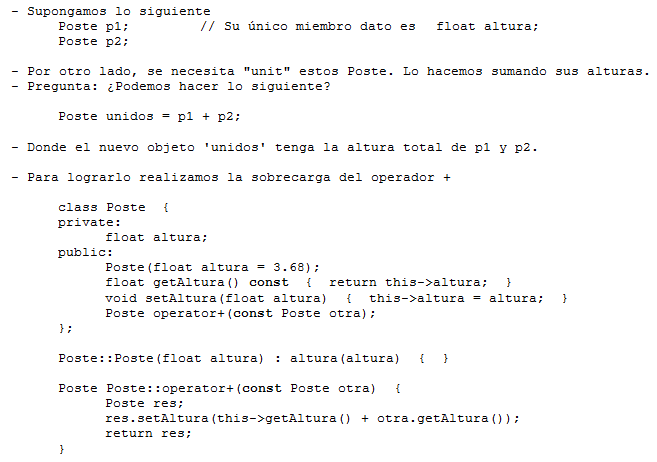

.. -*- coding: utf-8 -*-

.. _rcs_subversion:

Clase 02 - PGE 2015
===================

Sobrecarga de operadores 
========================

**Ejercicio:** Modificar la clase genérica Listado sobrecargando operator+ de tal forma que al sumar dos listados se obtenga un nuevo objeto Listado con los elementos consecutivos.

.. code-block::

	template <class T> class Listado  {
	public:
		Listado(int n=10);
		bool add(T nuevo);
		T get(int i) const;
		int length() const;
		Listado<T> operator+(const Listado<T> otro);

	private:
		int cantidad;
		int libre;
		T *v;
	};

	template <class T> Listado<T>::Listado(int n) : cantidad(n), libre(0), v(new T[n])  {  

	}

	template <class T> bool Listado<T>::add(T nuevo)  {
		if (libre < cantidad)  {
			v[libre] = nuevo;
			libre++;
			return true;
		}
		return false;
	}

	template <class T> T Listado<T>::get(int i) const  {  return v[i];  }

	template <class T> int Listado<T>::length() const  {  return libre;  }

	template <class T> Listado<T> Listado<T>::operator+(const Listado<T> otro)  {
		T vAux[this->length() + otro.length()];

		int contador = 0;

		for ( ; contador<this->length() ; contador++)
			vAux[contador] = this->get(contador);

		for (int i=0 ; contador < (this->length() + otro.length()) ; contador++, i++)
			vAux[contador] = otro.get(i);

		Listado<T> res(this->length() + otro.length());

		for (int j=0 ; j < contador ; j++)
			res.add(vAux[j]);

		return res;
	}

