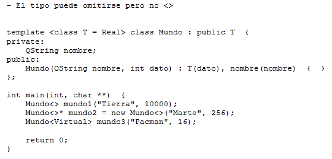
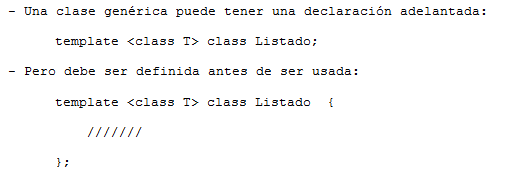
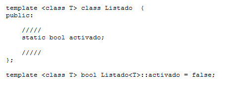
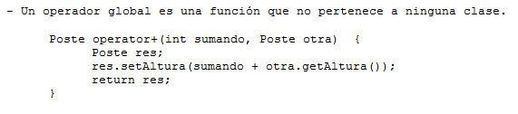

.. -*- coding: utf-8 -*-

.. _rcs_subversion:

Clase 03 - PGE 2015
===================

**Clase genérica con argumento por defecto**

**Declaración adelantada**

**Miembros estáticos**

**Ejercicio:** Utilizar la misma clase Poste para sobrecargar operator+ para que sume un objeto Poste con un int.

- Esa sobrecarga nos permitirá hacer Poste suma = p1 + 5;

- Qué pasa si queremos		 Poste suma = 5 + p1;
- Debemos hacerlo sobrecargando el operador global.

**Sobrecarga de operadores globales**

**Ejercicio:**
- Definir una clase genérica Vector que herede de QVector.
- Modificar el comportamiento de los siguientes métodos:
	- at() - En vez de obtener el primer elemento con 0 lo haga con 1, el 1 con 2,...
	- size() - Bloquearlo, que no se pueda usar.
	- float getPromedio() - Si los elementos son int o float, devolver el promedio sino devolver -1

Clase QCompleter
================

.. figure:: images/clase03/qcompleter.png

**Ejercicio 2:** Hacer lo mismo pero la base de datos que sea un archivo SQLite.

