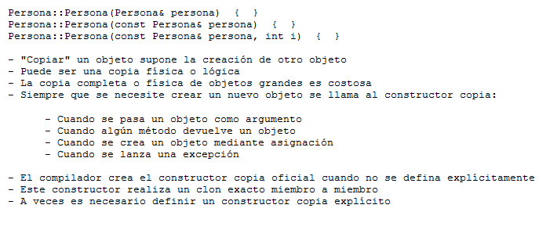

.. -*- coding: utf-8 -*-

.. _rcs_subversion:

Clase 04 - PGE 2016
===================

**Copiar objetos**

.. figure:: images/clase04/copiar_objetos.png

**Constructor copia**

**Operador de asignación**

.. figure:: images/clase04/operador_asignacion.png

**Ejercicio:**
	- Definir la clase Line que herede de QLineEdit
	- Sobrecargar el operator+ para que:
	
.. code-block:: c
	
	Line line = line1 + line2;	// Devuelve un Line con la suma de los textos
	

**Ejercicio:**

- Definir una clase genérica Vector que herede de QVector.
- Modificar el comportamiento de los siguientes métodos:
	- at() - En vez de obtener el primer elemento con 0 lo haga con 1, el 1 con 2,...
	- size() - Bloquearlo, que no se pueda usar.
	- float getPromedio() - Si los elementos son int o float, devolver el promedio sino devolver -1

Clase QCompleter
================

.. figure:: images/clase03/qcompleter.png

**Ejercicio:** Hacer lo mismo pero la base de datos que sea un archivo SQLite.

MiniExámenes
============

- Se promediarán para la tercer nota de POO
- Previstos: Agosto 24 - Agosto 31 - ...
- Tiempo: 30 minutos
- Temas para el 24 de agosto: 
	- template
	- Sobrecarga de operadores
	- Clase Listado

