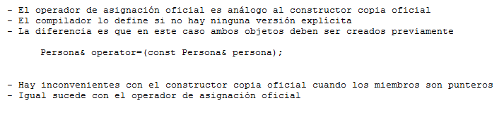

.. -*- coding: utf-8 -*-

.. _rcs_subversion:

Clase 04 - PGE 2016
===================

**Copiar objetos**

.. figure:: images/clase04/copiar_objetos.png

**Constructor copia**

.. figure:: images/clase04/constructor_copia.png

**Operador de asignación**

**Ejercicio:**
	- Definir la clase Line que herede de QLineEdit
	- Sobrecargar el operator+ para que:
	
.. code-block:: c
	
	Line line = line1 + line2;	// Devuelve un Line con la suma de los textos
	
MiniExámenes
============

- Se promediarán para la tercer nota de POO
- Previstos: Agosto 24 - Agosto 31 - ...
- Tiempo: 30 minutos
- Temas para el 24 de agosto: 
	- template
	- Sobrecarga de operadores
	- Clase Listado

