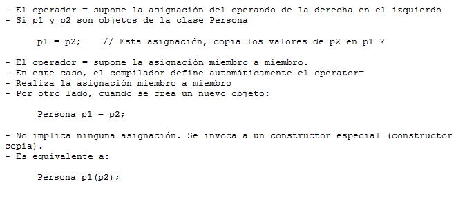

.. -*- coding: utf-8 -*-

.. _rcs_subversion:

Clase 04 - PGE 2015
===================

**Copiar objetos**

**Constructor copia**

.. figure:: images/clase04/constructor_copia.png

**Operador de asignación**

.. figure:: images/clase04/operador_asignacion.png

**Ejercicio:**
	- Definir la clase Line que herede de QLineEdit
	- Sobrecargar el operator+ para que:
	
	Line line = line1 + line2;	// Devuelve un Line con la suma de los textos

