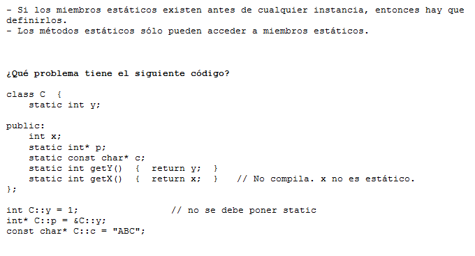
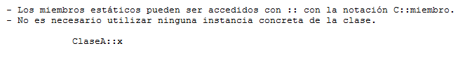
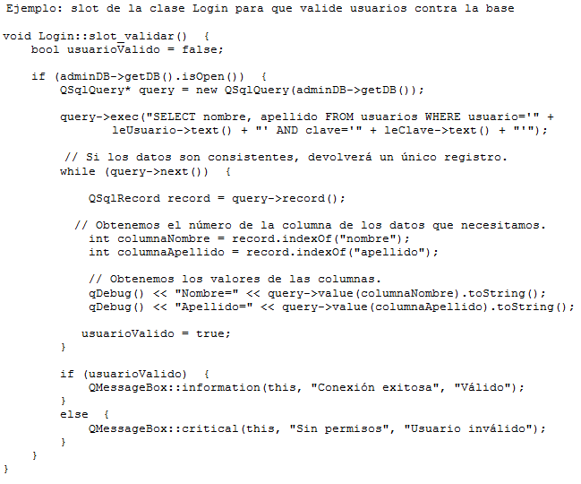

.. -*- coding: utf-8 -*-

.. _rcs_subversion:

Clase 10 - PGE 2015
===================

**typeid**

.. figure:: images/clase09/typeid.png

**Clase type_info**

- Dispone de un método para preguntar si es puntero y otro método para saber si es puntero a función:
		    
.. code-block::
			
	virtual bool __is_pointer_p() const;
   
	virtual bool __is_function_p() const;

.. figure:: images/clase09/type_info.png

**Ejercicio 1**

.. figure:: images/clase09/ejercicio1.png

**Ejercicio 2**

.. figure:: images/clase09/ejercicio2.png

Variables estáticas
===================

.. figure:: images/clase09/variables_estaticas.png

**Miembros estáticos**

.. figure:: images/clase09/miembros_estaticos1.png

.. figure:: images/clase09/miembros_estaticos2.png

.. figure:: images/clase09/miembros_estaticos3.png

**El constructor y miembros estáticos**

.. figure:: images/clase09/constructor_y_miembros_estaticos.png

**Particularidades de la notación**

.. figure:: images/clase09/miembros_estaticos5.png

**Ejercicio 3**

Base de datos con SQLite
========================

.. figure:: images/clase09/sqlite1.png

.. figure:: images/clase09/sqlite2.png

.. figure:: images/clase09/sqlite3.png

**Ejercicio 4**

.. figure:: images/clase09/ejercicio4a.png

.. figure:: images/clase09/ejercicio4b.png

**Para independizar del SO**

.. figure:: images/clase09/independizar.png

**Consulta a la base de datos**

.. figure:: images/clase09/consultar1.png

Utilización de cámaras de video con Qt
======================================

- Clase QCamera: Controlador de las cámaras
- Clase QCameraViewfinder: Es un QWidget visualizador de imágenes de la cámara
- Clase QCameraInfo: Listado de las cámaras disponibles y la info de cada una
- Requiere en el .pro: QT += multimedia multimediawidgets #Qt5.3 mínimo

**Publicar la descripción de las cámaras disponibles**

.. code-block::

	QList<QCameraInfo> cameras = QCameraInfo::availableCameras();
	for (int i=0 ; i<cameras.size() ; i++)  
	    qDebug() << cameras.at(i).description();

**Instanciar QCamera y mostrar los frames sobre el QCameraViewfinder**

.. code-block::

    QCameraInfo cameraInfo = cameras.at(0);
    QCamera * camera = new QCamera(cameraInfo);

    QCameraViewfinder *visor = new QCameraViewfinder;

    camera->setViewfinder(visor);
    camera->start();

    visor->show();

**Creación de un visor promovido a QWidget para QtDesigner**

.. code-block::

	// Puede estar sólo en el .h (en visor.h)
	#ifndef VISOR_H
	#define VISOR_H

	#include <QCameraViewfinder>

	class Visor : public QCameraViewfinder  {
	    Q_OBJECT
	public:
	    explicit Visor(QWidget *parent = 0 ) : QCameraViewfinder(parent)  {   }
	};

	#endif // VISOR_H

**Ejercicio 1:**

- Crear una aplicación con un QCameraViewfinder promovido a QWidget en QtDesigner
- Un botón "Mostrar imagen" para que encienda la cámara y muestre la imagen

**Ejercicio 2:**

- Una aplicación que complete un QComboBox con las cámaras disponibles
- Un QPushButton para iniciar la cámara seleccionada

**Resolución**

:Código fuente: https://github.com/cosimani/Curso-PGE-2015/tree/master/sources/clase10/camera

**Análisis pixel a pixel**

- Ejemplo: Dejar sólo el componente rojo

.. code-block::

    QPixmap pixMap = ui->visor->grab();  // Para llevar el QWidget a QImage
    QImage image = pixMap.toImage();

    for (int x=0 ; x<image.width() ; x++)  {
        for (int y=0 ; y<image.height() ; y++)  {
            QRgb rgb = image.pixel(x, y);  // typedef unsigned int QRgb;
            QRgb nuevoValorRgb = qRgb(qRed(rgb), 0, 0);
            image.setPixel(x, y, nuevoValorRgb);
        }
    }

**Ejercicio 3:**

- Agregar un QPushButton "Capturar imagen" para procesarla
- Dibujar con paintEvent esa imagen procesada 
- Procesar la imagen con lo siguiente:
	- Invertir los colores rgb a bgr
	- Transformar a escala de grises
		Y = 0.3 R + 0.3 G + 0.3 B // Y en cada componente
	- Convertir al negativo: Cada componente, si lo leemos en binario, debemos invertir cada bit.
		- Ejemplo: R=144=10010000 -> R=01101111

