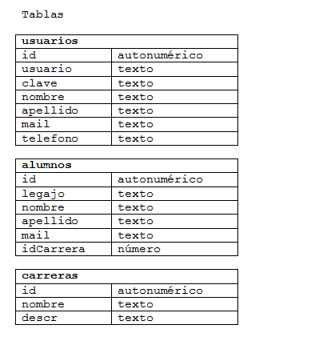

.. -*- coding: utf-8 -*-

.. _rcs_subversion:

Clase 11 - PGE 2016
===================

Base de datos con SQLite
========================

.. figure:: images/clase09/sqlite1.png

.. figure:: images/clase09/sqlite2.png

**Ejercicio 4**

.. figure:: images/clase09/ejercicio4.png

.. figure:: images/clase09/ejercicio4a.png

.. figure:: images/clase09/ejercicio4b.png

**Para independizar del SO**

.. figure:: images/clase09/independizar.png

**Consulta a la base de datos**

.. figure:: images/clase09/consultar1.png

.. figure:: images/clase09/consultar2.png

Utilización de cámaras de video con Qt
======================================

- Clase QCamera: Controlador de las cámaras
- Clase QCameraViewfinder: Es un QWidget visualizador de imágenes de la cámara
- Clase QCameraInfo: Listado de las cámaras disponibles y la info de cada una
- Requiere en el .pro: QT += multimedia multimediawidgets #Qt5.3 mínimo

**Publicar la descripción de las cámaras disponibles**

.. code-block::

	QList<QCameraInfo> cameras = QCameraInfo::availableCameras();
	for (int i=0 ; i<cameras.size() ; i++)  
	    qDebug() << cameras.at(i).description();

**Instanciar QCamera y mostrar los frames sobre el QCameraViewfinder**

.. code-block::

    QCameraInfo cameraInfo = cameras.at(0);
    QCamera * camera = new QCamera(cameraInfo);

    QCameraViewfinder *visor = new QCameraViewfinder;

    camera->setViewfinder(visor);
    camera->start();

    visor->show();

**Creación de un visor promovido a QWidget para QtDesigner**

.. code-block::

	// Puede estar sólo en el .h (en visor.h)
	#ifndef VISOR_H
	#define VISOR_H

	#include <QCameraViewfinder>

	class Visor : public QCameraViewfinder  {
	    Q_OBJECT
	public:
	    explicit Visor(QWidget *parent = 0 ) : QCameraViewfinder(parent)  {   }
	};

	#endif // VISOR_H

**Ejercicio 1:**

- Crear una aplicación con un QCameraViewfinder promovido a QWidget en QtDesigner
- Un botón "Mostrar imagen" para que encienda la cámara y muestre la imagen

**Ejercicio 2:**

- Una aplicación que complete un QComboBox con las cámaras disponibles
- Un QPushButton para iniciar la cámara seleccionada

**Resolución**

:Código fuente: https://github.com/cosimani/Curso-PGE-2015/tree/master/sources/clase10/camera

**Análisis pixel a pixel**

- Ejemplo: Dejar sólo el componente rojo

.. code-block::

    QPixmap pixMap = ui->visor->grab();  // Para llevar el QWidget a QImage
    QImage image = pixMap.toImage();

    for (int x=0 ; x<image.width() ; x++)  {
        for (int y=0 ; y<image.height() ; y++)  {
            QRgb rgb = image.pixel(x, y);  // typedef unsigned int QRgb;
            QRgb nuevoValorRgb = qRgb(qRed(rgb), 0, 0);
            image.setPixel(x, y, nuevoValorRgb);
        }
    }

**Ejercicio 3:**

- Agregar un QPushButton "Capturar imagen" para procesarla
- Dibujar con paintEvent esa imagen procesada 
- Procesar la imagen con lo siguiente:
	- Invertir los colores rgb a bgr
	- Transformar a escala de grises
		Y = 0.3 R + 0.3 G + 0.3 B // Y en cada componente
	- Convertir al negativo: Cada componente, si lo leemos en binario, debemos invertir cada bit.
		- Ejemplo: R=144=10010000 -> R=01101111

**CLI >> GUI >> NUI**

.. figure:: images/clase11/cli_gui_nui.png
	:target: https://prezi.com/_iqvhrobpe0p/desarrollo/

	
Levantar frame por frame: Clase QAbstractVideoSurface
=====================================================

- QAbstractVideoSurface es una clase abstracta
- Proporciona streaming de video a través de la función virtual pura present()

.. code-block:: c++

	bool QAbstractVideoSurface::present ( const QVideoFrame & frame ) [pure virtual]

**Clase Capturador para obtener los frames de la cámara**

.. code-block:: c++

	class Capturador : public QAbstractVideoSurface  {
		Q_OBJECT

	public:
		Capturador(QObject *parent = 0);

		QList<QVideoFrame::PixelFormat> supportedPixelFormats(
				QAbstractVideoBuffer::HandleType handleType = QAbstractVideoBuffer::NoHandle) const;

		bool present(const QVideoFrame &frame);

		QVideoFrame getFrameActual()  {  return frameActual;  }

	private:
		QVideoFrame frameActual;
	};

- QVideoFrame encapsula los datos de video (bits, ancho, alto, etc.)
- Para acceder a los bits es necesario mapearlo con el método map()
- El mapeo deja en memoria los datos para se accedidos.

.. code-block:: c++

	bool Capturador::present(const QVideoFrame &frame)  {
		frameActual = frame;
		
		frameActual.map(QAbstractVideoBuffer::ReadOnly);
		
		return true;  // Con la idea de devolver true si este frame fue usado
	}

- La función virtual pura supportedPixelFormats() devuelve un listado de formatos soportados.

.. code-block:: c++

	QList<QVideoFrame::PixelFormat> 
	Capturador::supportedPixelFormats(QAbstractVideoBuffer::HandleType handleType) const  {
	
		if (handleType == QAbstractVideoBuffer::NoHandle) {
			return QList<QVideoFrame::PixelFormat>()
					<< QVideoFrame::Format_RGB32
					<< QVideoFrame::Format_ARGB32;
		} else {
			return QList<QVideoFrame::PixelFormat>();
		}
		
	}

**El constructor**

.. code-block:: c++

	Capturador::Capturador(QObject *parent) : QAbstractVideoSurface(parent)  {

	}

**Podemos ahora llevar las imágenes de la cámara como textura a OpenGL**

.. code-block:: c++

	class Visual : public Ogl  {
		Q_OBJECT
	public:
		Visual();
		void iniciarCamara();

	protected:
		void initializeGL();
		void resizeGL(int ancho, int alto);
		void paintGL();

	private:
		Capturador * capturador;
		QCamera * camera;

		void cargarTexturas();
		void cargarTexturaCamara();

		unsigned char *texturaCielo;
		unsigned char *texturaMuro;
		GLuint idTextura[2];

		unsigned char *texturaCamara;
		GLuint idTexturaCamara[1];
	};

	void Visual::iniciarCamara()  {
		capturador = new Capturador;

		QList<QCameraInfo> cameras = QCameraInfo::availableCameras();

		for (int i=0 ; i<cameras.size() ; i++)  {
			qDebug() << cameras.at(i).description();

			if (cameras.at(i).description().contains("Truevision", Qt::CaseInsensitive))  {
				camera = new QCamera(cameras.at(i));
				camera->setViewfinder(capturador);
				camera->start(); // to start the viewfinder
			}
		}

		glGenTextures(1, idTexturaCamara);
	}

	void Visual::cargarTexturaCamara()  {

		QVideoFrame frameActual = capturador->getFrameActual();
		texturaCamara = frameActual.bits();

		glBindTexture(GL_TEXTURE_2D, idTexturaCamara[0]);  // Activamos idTextura.
		glTexParameteri(GL_TEXTURE_2D, GL_TEXTURE_MAG_FILTER, GL_LINEAR); 
		glTexParameteri(GL_TEXTURE_2D, GL_TEXTURE_MIN_FILTER, GL_LINEAR); 

		glTexImage2D(GL_TEXTURE_2D, 
		             0, 
		             3, 
		             frameActual.width(), 
		             frameActual.height(), 
		             0, 
		             GL_BGRA, 
		             GL_UNSIGNED_BYTE, 
		             texturaCamara);
	}

**Ejercicio 1:**

- Crear una escena con OpenGL con glOrtho para mostrar como textura las imágenes de la cámara en un QUADS.
- Luego probar con gluPerspective

**Resolución**

:Código fuente: https://github.com/cosimani/Curso-PGE-2015/tree/master/sources/clase11/ejercicio1
	
**Ejercicio 2:**

- Crear una aplicación para mostrar una escena 3D con OpenGL que tenga las siguientes características:
	- Utilizar la clase Ogl
	- La escena tendrá un cielo como se muestra a continuación:

.. figure:: images/clase11/cielo.jpg
	:target: http://img02.bibliocad.com/biblioteca/image/00010000/4000/cieloclaro_14054.jpg

- Ahora agregar una textura para el piso. Esta textura deberá repetirse para que quede similar a la siguiente figura:

.. figure:: images/clase11/tierra.jpg
	:target: http://www.textureimages.net/uploads/6/1/2/6/6126732/8772372_orig.jpg

- Dibujar ahora un muro al final del camino. Que la textura se repita también. 

.. figure:: images/clase11/pared.jpg
	:target: http://img02.bibliocad.com/biblioteca/image/00030000/0000/muropiedratextura_30115.jpg
	
- Utilizando las teclas UP y DOWN generar el efecto de avanzar y retroceder. Que no permita irse más allá del muro y que no permita retroceder más del punto inicial de partida.

.. figure:: images/clase11/escena.png

**Ejercicio 3:**

- Usar el ejercicio anterior
- Colgar de la tapia del fondo un monitor LCD mostrando las imágenes de la cámara

**Ejercicio 4:**

- En el medio del escenario tapia-piso-cielo dibujar un cubo girando
- Pegar la textura de la cámara en cada lado del cubo

Uso de atributos estáticos
^^^^^^^^^^^^^^^^^^^^^^^^^^

.. code-block:: c++

	#ifndef ARCHIVADOR_H
	#define ARCHIVADOR_H

	#include <QFile>
	#include <QTextStream>

	class Archivador  {
	private:
		static QFile *file;

	public:
		static bool abrir(QString ruta);
		static bool almacenar(QString texto);
	};

	QFile * Archivador::file = new QFile("./defecto.txt");

	bool Archivador::abrir(QString ruta)  {
		file->setFileName(ruta);

		if (!file->exists())  {
			return false;
		}

		return file->open(QIODevice::Append | QIODevice::Text);
	}

	bool Archivador::almacenar(QString texto)  {
		if (!file->isOpen())
			return false;

		QTextStream salida(file);
		salida << texto;

		return true;
	}

	#endif // ARCHIVADOR_H

**Ejercicio 5:**

- En el ejemplo de la clase Archivador, es necesario intanciar un objeto Archivador para poder usarlo.
- Intente instanciar un objeto Archivador de manera estática.
	
TPU
===

.. figure:: images/clase11/tpu.png	

