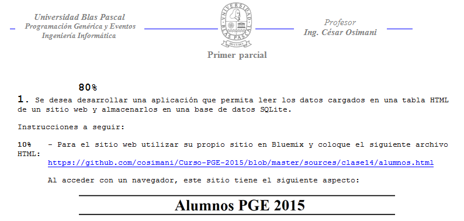
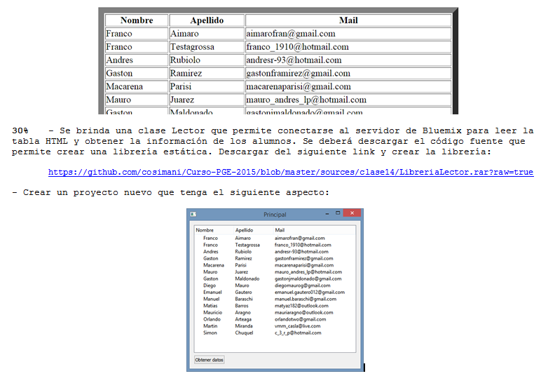
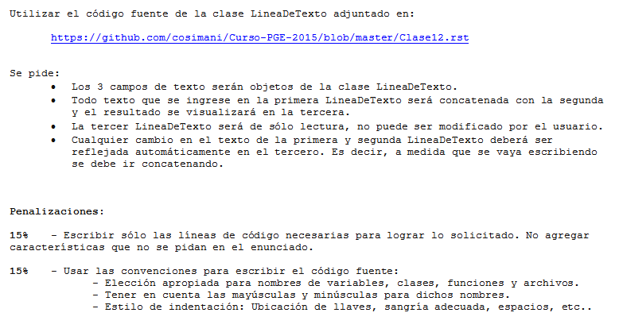

.. -*- coding: utf-8 -*-

.. _rcs_subversion:

Clase 14 - PGE 2015
===================

Uso de atributos estáticos
^^^^^^^^^^^^^^^^^^^^^^^^^^

.. code-block:: c++

	#ifndef ARCHIVADOR_H
	#define ARCHIVADOR_H

	#include <QFile>
	#include <QTextStream>

	class Archivador  {
	private:
		static QFile *file;

	public:
		static bool abrir(QString ruta);
		static bool almacenar(QString texto);
	};

	QFile * Archivador::file = new QFile("./defecto.txt");

	bool Archivador::abrir(QString ruta)  {
		file->setFileName(ruta);

		if (!file->exists())  {
			return false;
		}

		return file->open(QIODevice::Append | QIODevice::Text);
	}

	bool Archivador::almacenar(QString texto)  {
		if (!file->isOpen())
			return false;

		QTextStream salida(file);
		salida << texto;

		return true;
	}

	#endif // ARCHIVADOR_H

**Ejercicio 5:**

- En el ejemplo de la clase Archivador, es necesario intanciar un objeto Archivador para poder usarlo.
- Intente instanciar un objeto Archivador de manera estática.
	
TPU
===

Ejemplos de ejercicios del primer parcial
^^^^^^^^^^^^^^^^^^^^^^^^^^^^^^^^^^^^^^^^^

**Ejercicio 1:**

- Se adjunta el código fuente para que sea compilado en una librería estática.
- Separar en distintas carpetas los archivos de cabecera y la librería estática (por ejemplo, en las carpetas 'includes' y 'libs'

**Ejercicio 2:**

- En un proyecto nuevo, utilizar la librería generada en el ejercicio 1 para crear la GUI de la siguiente figura.
- Los 3 campos de texto son objetos de LineaDeTexto promovidos a QLineEdit dentro del QtDesigner.
- Presionando el QPushButton se realiza la concatenación de los textos con el operator+ de LineaDeTexto y se muestra el resultado en el tercer campo de texto.

.. figure:: images/clase12/ejercicio1.png

**Ejercicio 3:**

- Incorporar a la clase LineaDeTexto del ejercicio 1 la característica del popup para sugerencias.
- Compilarlo como librería estática en el archivo libLineaConSugerenciaLIB.a
- Usarlo nuevamente en otro proyecto.

Bluemix - Material para primer parcial
^^^^^^^^^^^^^^^^^^^^^^^^^^^^^^^^^^^^^^

**¿Cómo utilizar Bluemix?**

- Crear una cuenta en: https://console.ng.bluemix.net (gratis durante 30 días, luego se paga por lo que se usa)
- Crear una instancia de Node-Red
- Crear un host bajo el dominio mybluemix.net donde se alojará el sitio ( por ejemplo: misitio.mybluemix.net )
- Añadir un alias en el Git de Bluemix
- Con el botón "Edit Code" comenzar a editar el código fuente y archivos dentro de Git
- Desde https://www.dropbox.com/sh/5ngfvs2wkq7amnl/AAAMLK8XkgZQ9LEMEl-sYkGBa?dl=0 se puede descargar algunos documentos y código fuente de ejemplo
- Copiar los tres archivos (cloud.html, d3.layout.cloud.js y d3.v3.min.js) dentro del sitio (File - Import file or zip). Abrir el archivo cloud.html y eliminar el uso del puerto 1880.
- Tildamos "Edición en directo" (live edit) para que tome todos los cambios al instante
- Para poner el sitio online por primera vez clic en el ícono "play"
- Abrimos en un navegador http://misitio.mybluemix.net/ o directamente a http://misitio.mybluemix.net/cloud.html
- Luego podemos ir a http://misitio.mybluemix.net/red/ para el flow editor (aquí podemos importar el archivo wordcloud.txt para ver un ejemplo)
- Podemos usar módulos de twitter, mailing, visión artificial, etc.

- Más info en: http://node-red-ws.mybluemix.net/presentation/index.html#slide-12

**Ejemplo 1**

- En Node-RED dentro de una sheet
- Arrastrar un nodo entrada Inject y abrir su configuración
- Payload como string y colocar "Primer parcial"
- Arrastrar un nodo salida debug
- Conectar los dos nodos Inject y Debug
- Clic en Deploy
- Ir al tab Debug que está a la derecha
- Hacer clic en el nodo inject para que envíe el mensaje

**Ejemplo 2**

- Eliminar la conexión entre Inject y Debug
- Abrir configuración de Inject y seleccionar Payload blank
- Arrastrar un nodo function e ingresar el siguiente código: msg.name = 'Parcial'; return msg;
- Conectar los nodos.
- Arrastrar un nodo Template, abrir la configuración y setear lo siguiente: El texto enviado es: {{name}}
- Deploy y probar

**Ejemplo 3**

- Reemplazar el nodo Inject por un nodo http
- Elegir GET y en la URL poner /parcial
- Conectar el nodo http al nodo function
- En la configuración de function: msg.name = msg.req.query.name; return msg;
- Borrar el nodo Debug
- Agregar un nodo http response node y conectarlo al nodo temcplate
- Deploy y probar ingresando a http://misitio.mybluemix.net/parcial?name=Carlos 

**Ejercicio**

- Armar una base de datos con SQLite 
- La base tiene la tabla http con los siguientes campos: id campo1 campo2 campo3
- La tabla sólo tendrá un único registro
- Con una aplicación Qt leer la base de datos y pasar por GET los parámetros a http://misitio.mybluemix.net/parcial?campo1=dato1&campo2=dato2&campo3=dato3
- Crear la aplicación en Bluemix para que pueda publicar estos datos en una tabla HTML
- Finalmente mostrarlo en un QWebView

Primer Parcial
^^^^^^^^^^^^^^

**Enunciado de los 2 ejercicios**

.. figure:: images/clase14/03.png

**Resolución** :+1:

* `Ejercicio 1 (Resolución) <https://github.com/cosimani/Curso-PGE-2015/blob/master/sources/clase14/Ejercicio1.rar?raw=true>`_
* `Ejercicio 2 (Resolución) <https://github.com/cosimani/Curso-PGE-2015/blob/master/sources/clase14/Ejercicio2.rar?raw=true>`_

