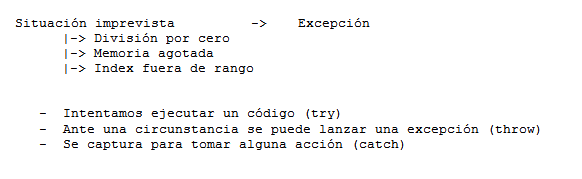

.. -*- coding: utf-8 -*-

.. _rcs_subversion:

Clase 15 - PGE 2016
===================

Tratamiento de excepciones
^^^^^^^^^^^^^^^^^^^^^^^^^^

* `Explicación por un youtuber <http://www.youtube.com/watch?v=wcuknro_V-w>`_

**Excepciones de la biblioteca estándar de C++**

.. figure:: images/clase15/excepciones2.png

**Ejemplo creando nuestras propias clases para excepciones**

.. code-block:: c++

	#ifndef EXCEPCIONES_H
	#define EXCEPCIONES_H

	#include <QString>
	#include <QFile>

	class ExcRango  {
	private:
	    QString mensaje;
	public:
	    ExcRango(QString mensaje, int i) : mensaje(mensaje)  {   }
	    QString getMensaje()  {  return mensaje;  }
	};

	class ExcNoArchivo  {
	private:
	    QString archivo;
	    QString mensaje;

	public:
	    ExcNoArchivo(QString archivo) : archivo(archivo)  {
	        QFile file(archivo);
	        if (!file.exists())
	            mensaje.operator=("El archivo " + archivo + " no existe.");
	    }

	    QString getMensaje()  {  return mensaje;  }
	};

	#endif // EXCEPCIONES_H

.. code-block:: c++

	#ifndef ARCHIVADOR_H
	#define ARCHIVADOR_H

	#include <QFile>
	#include <QTextStream>
	#include "excepciones.h"

	class Archivador  {
	private:
	    static QFile *file;

	public:
	    static bool abrir(QString ruta)  {
	        file->setFileName(ruta);

	        if (!file->exists())  {
	            throw ExcNoArchivo(ruta);
	            return false;
	        }

	        return file->open(QIODevice::Append | QIODevice::Text);
	    } 

	    static bool almacenar(QString texto)  {
	        if (!file->isOpen())
	        return false;

	        QTextStream salida(file);
	        salida << texto;
 
	        return true;
	    }
	};

	QFile * Archivador::file = new QFile("./defecto.txt");

	#endif // ARCHIVADOR_H

.. code-block:: c++

	#include <QApplication>
	#include "archivador.h"
	#include <QDebug>

	int main(int argc, char** argv)  {
	    QApplication a(argc, argv);

	    try  {
	        Archivador::abrir("./defecto.txt");
	        Archivador::almacenar("11111111");
	    }
	    catch(ExcNoArchivo e)  {
	        qDebug() << e.getMensaje();
	    }

	    return 0;
	}
	
**Ejercicio 1:**

- Modificar la clase listado para que cuando sea necesario lance la excepción ExcRango cuando se intente acceder a un index fuera de rango. Probarlo luego en la función main.

.. code-block:: c++

	template <class T> class Listado  {
	private:
	    int cantidad;
	    int libre;
	    T *v;

	public:
	    Listado(int n=10) : cantidad(n), libre(0), v(new T[n])  {  }
	    bool add(T nuevo);

	    T get(int i)  {
	        if (i>=libre)
	            throw ExcRango("Listado fuera de rango", i);
	        return v[i];
	    }

	    int length()  {  return libre;  }
	};

	template <class T> bool Listado<T>::add(T nuevo)  {
	    if (libre < cantidad)  {
	        v[libre] = nuevo;
	        libre++;
	        return true;
	    }
	    return false;
	}
