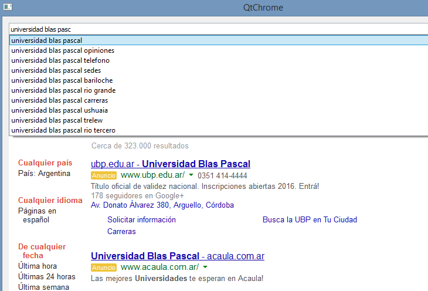

.. -*- coding: utf-8 -*-

.. _rcs_subversion:

Clase 18 - PGE 2015
===================

**Ejercicio 1:**

- Modificar el ejercicio de la clase ListadoEnteros para usar funciones globales de ordenamiento, es decir, que no se encuentren dentro de Ordenador ni de ninguna clase.

.. code-block:: c++	

	class ListadoEnteros : public QVector<int>  {
	public:
	    void ordenar(void (*pFuncionOrdenamiento)(int *, int))  {
	        (*pFuncionOrdenamiento)(this->data(), this->size());
	    }
	};

.. code-block:: c++		
	///// Desde main se puede utilizar así:

    void (*ordenador)(int *, int) = &burbuja;

    listado.ordenar(ordenador);

**Ejercicio 2:**

- Modificar el ejercicio anterior usando también funciones globales de ordenamiento pero con la clase ListadoGenerico que sea un template:

.. code-block:: c++	

	template<class T> class ListadoGenerico : public QVector<T>  {
	public:
	    void ordenar(void (*pFuncionOrdenamiento)(int *, int))  {
	        (*pFuncionOrdenamiento)(this->data(), this->size());
	    }
	};

**Ejercicio 3:**

- Necesitamos conocer el rendimiento de cada algoritmo de ordenamiento midiendo su tiempo.
- Utilizar un array de punteros a funciones que apunte a cada función global de ordenamiento.
- Utilizar Archivador para almacenar los tiempos en un archivo.
- Utilizar un ListadoEnteros de 50.000 números generados con qrand()

.. code-block:: c++		

	///// Desde main se puede utilizar así:

    void (*ordenador[2])(int *, int);
    ordenador[0] = &burbuja;
    ordenador[1] = &insercion;

    listado.ordenar(ordenador[1]);

**Ejercicio 4:** 

- Agregar la funcionalidad de sugerencias a la clase LineaDeTexto y que dichas sugerencias las busque desde Google.
- http://doc.qt.io/qt-5/qtnetwork-googlesuggest-example.html
- `Descargar LineaDeTexto desde aquí <https://github.com/cosimani/Curso-PGE-2015/blob/master/sources/clase18/lineadetexto.rar?raw=true>`_
- Crear un QtChrome que permita buscar en Google la sugerencia elegida. 
- Notar la signal que tiene disponible LineaDeTexto.
- Para lograr la búsqueda en Google se puede usar la siguiente URL: https://www.google.com.ar/search?source=lnms&sa=X&dpr=1&q=ubp
- Que la aplicación tenga un aspecto como:

