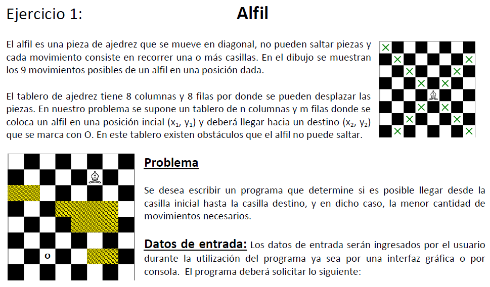
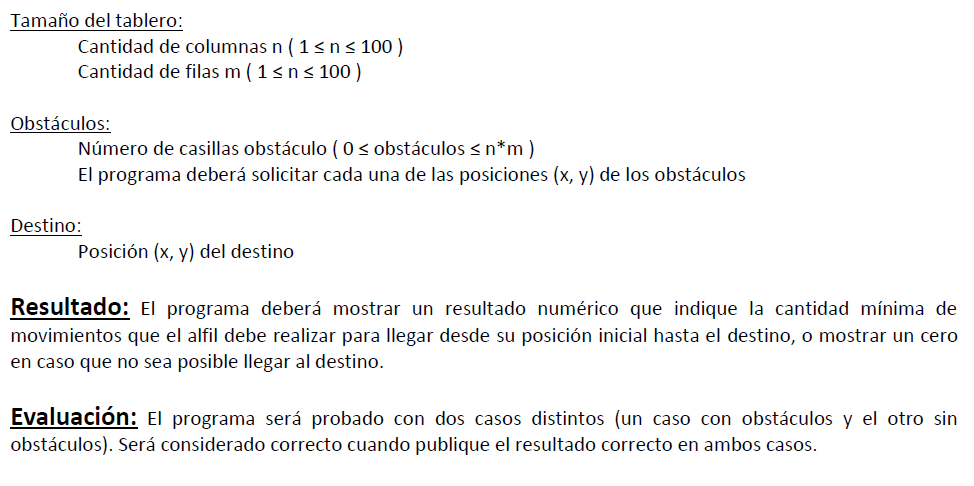

.. -*- coding: utf-8 -*-

.. _rcs_subversion:

Clase 21 - PGE 2015
===================

Ejercicio para ONIET 2015
^^^^^^^^^^^^^^^^^^^^^^^^^

- Prestar atención porque algo va a salir inspirado por este ejercicio.

Temas para segundo parcial
^^^^^^^^^^^^^^^^^^^^^^^^^^

- Imágenes de cámaras con QCameraViewfinder y QAbstractVideoSurface (traer cámara USB si va a usar PC de laboratorio).
- Análisis pixel a pixel, escala de grises, negativo, eliminar componente
- Tratamiento de excepciones
- Hilos con QThread
- Callback, punteros a funciones, punteros a métodos de clases
- LineaDeTexto con sugerencia de Google
- OpenGL, texturas, imagen de la cámara como textura
- No va: Seguimiento de objetos ni base de datos

Ejemplo base para el parcial
^^^^^^^^^^^^^^^^^^^^^^^^^^^^

- Permite desplazarse con teclado y mouse dentro de la escena OpenGL
- `Descargar proyecto base desde aquí <https://github.com/cosimani/Curso-PGE-2015/blob/master/sources/clase21/DesplazamientoEnEscena.rar?raw=true>`_
- Notar lo siguiente:
	- Método para dibujar plano horizontal y vertical
	- Control del mouse para la rotación
	- Teclas para el desplazamiento hacia adelante y atrás
	- Forma de organizar las carpetas
- Tener en cuenta:
	- Se puede pedir mirar para arriba y abajo
	- Saltar
	- Desplazarse hacia laterales

Ejercicio 1
^^^^^^^^^^^

- Dentro de la escena mostrar la cámara.
- Que permita pausar la cámara con la letra P.
	