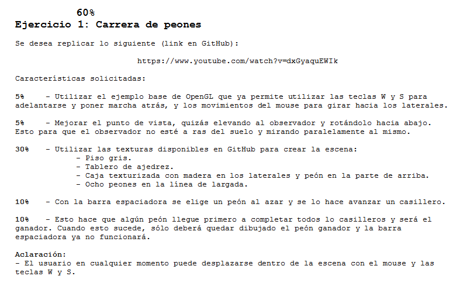
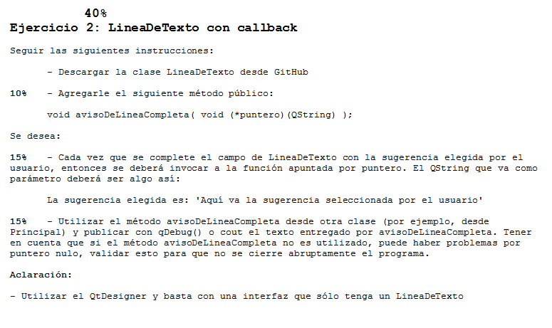

.. -*- coding: utf-8 -*-

.. _rcs_subversion:

Clase 22 - PGE 2015
===================

Recursos para Segundo parcial
^^^^^^^^^^^^^^^^^^^^^^^^^^^^^

- `Texturas <https://github.com/cosimani/Curso-PGE-2015/blob/master/resources/clase22/texturas.rar?raw=true>`_

- Video sobre lo que se desea replicar (https://www.youtube.com/watch?v=dxGyaquEWIk)

- `LineaDeTexto <https://github.com/cosimani/Curso-PGE-2015/blob/master/sources/clase18/lineadetexto.rar?raw=true>`_

**Enunciado de los 2 ejercicios**

**Resolución** :+1:

* `Ejercicio 1 (Resolución) <https://github.com/cosimani/Curso-PGE-2015/blob/master/sources/clase22/Ejercicio1.rar?raw=true>`_
* `Ejercicio 2 (Resolución) <https://github.com/cosimani/Curso-PGE-2015/blob/master/sources/clase22/Ejercicio2.rar?raw=true>`_
